Benchmark
=========

System information: 
c++ compiler: /usr/bin/c++  
c++ compiler version: c++ (Ubuntu 5.4.0-6ubuntu1~16.04.4) 5.4.0 20160609  
compiler flags:  -std=c++11 -march=native -Wall -pedantic -O3 -DNDEBUG  
cpu: Intel(R) Core(TM) i3-5010U CPU @ 2.10GHz  
boost: 1_58  
os: Ubuntu 16.04.2 LTS  

map search
----------

Variable number of items is added to map (number of items stored in map is the value on X axis).
Then constant number of map searches is done. Number of microseconds that test takes is the value of Y axis.
Key is random uint64 value.

comparison of tree, hash table and binary search maps
-----------------------------------------------------

Comparison of tree, hash and binary search structures with up to 350 elements: 

Comparison of tree, hash and binary search structures with up to 3500 elements: 

Comparison of tree, hash and binary search structures with up to 100000 elements: 
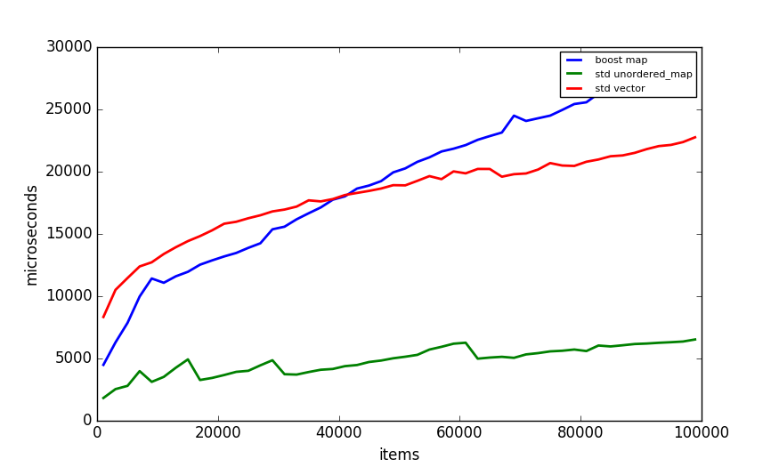

comparison of tree maps
-----------------------

Comparison of tree structures with up to 350 elements: 

Comparison of tree structures with up to 3500 elements: 

Comparison of tree structures with up to 100000 elements: 
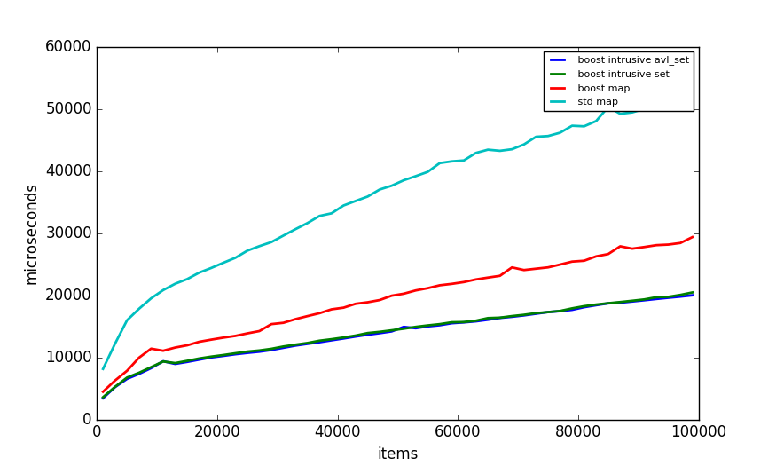

comparison of hash table maps
-----------------------------

Comparison of hash table structures with up to 350 elements: 
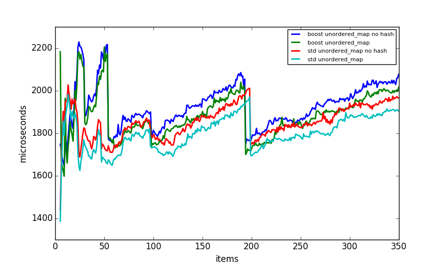

Comparison of hash table structures with up to 3500 elements: 

Comparison of hash table structures with up to 100000 elements: 

comparison of binary search maps
--------------------------------

Comparison of binary search structures with up to 350 elements: 

Comparison of binary search structures with up to 3500 elements: 
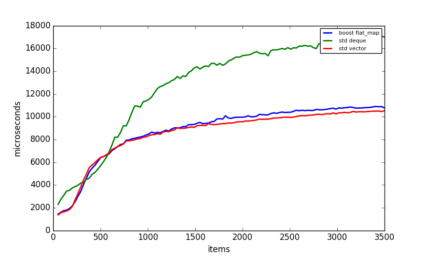

Comparison of binary search structures with up to 100000 elements: 

search in map with string keys
------------------------------

X number of items is added to map, than constant number of searches are performed.
Key is a random string. String is std::string, char p is a char pointer.

comparison of tree and hash table maps with string key
------------------------------------------------------

Tree and hash table maps with 16 byte string keys: 
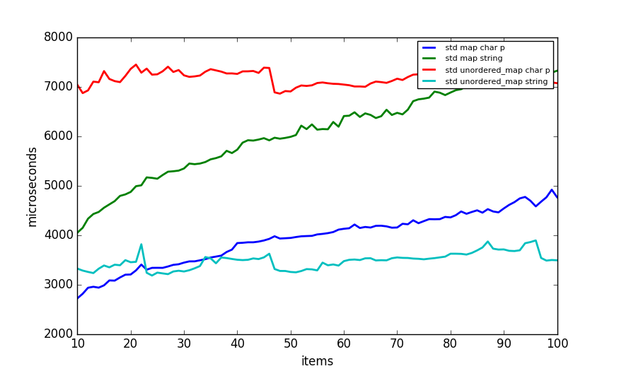

Tree and hash table maps with 16 byte string keys: 
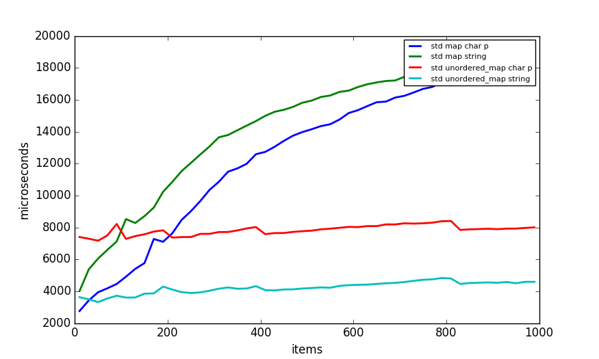

tree maps with string key
-------------------------

Tree maps with 16 byte string keys: 
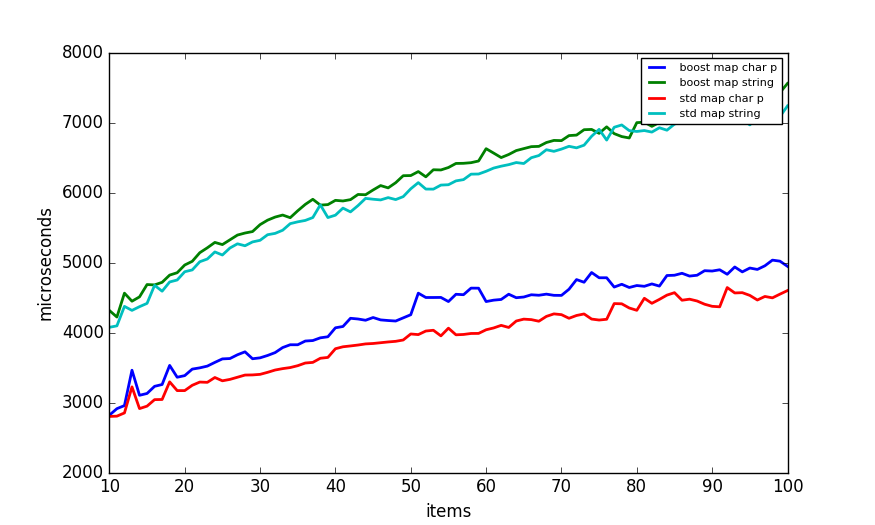

Tree maps with 16 byte string keys: 
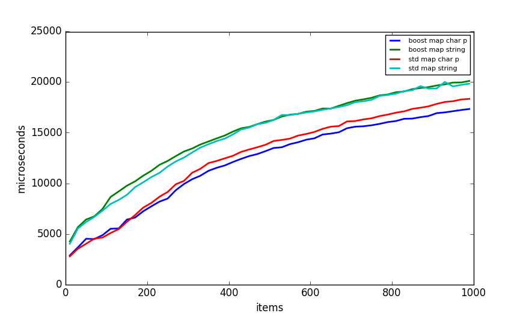

Tree maps with 4 byte string keys: 
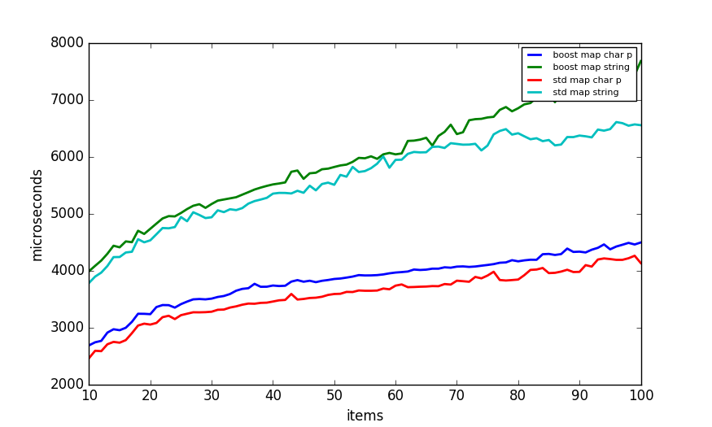

Tree maps with 4 byte string keys: 

hash table maps with string key
-------------------------------

hash table maps with 16 byte string keys:

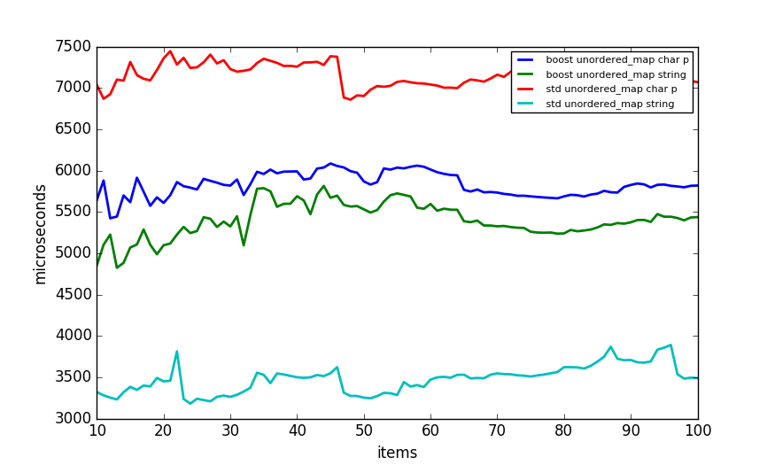

hash table maps with 16 byte string keys:

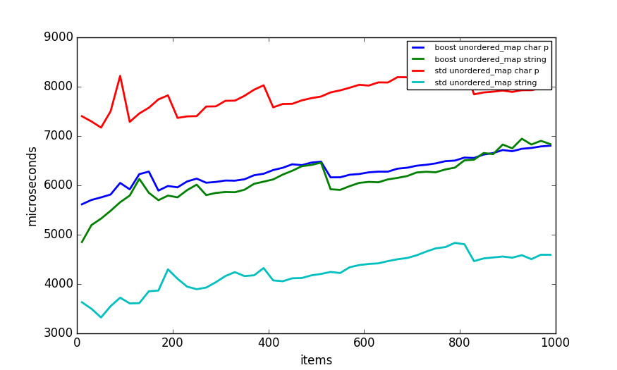

hash table maps with 4 byte string keys:

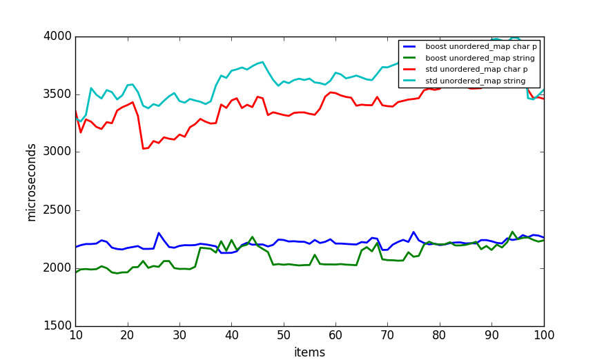

hash table maps with 4 byte string keys:

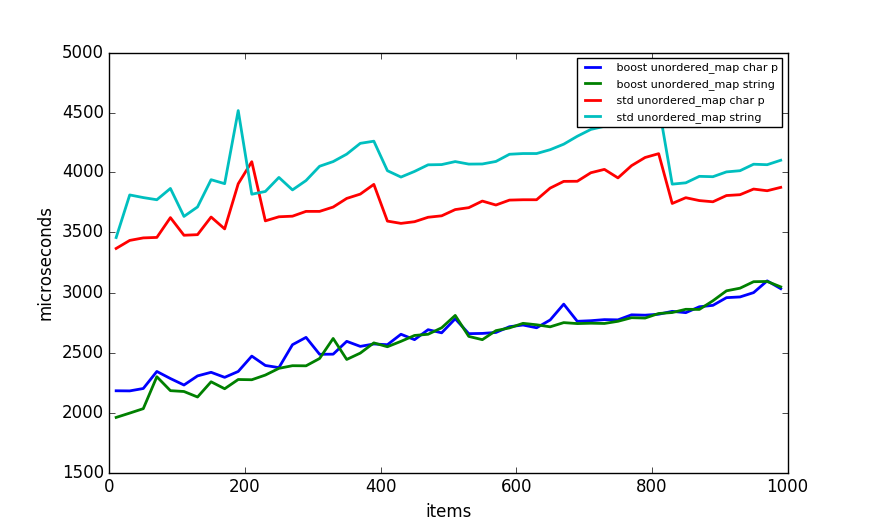

map insert
----------

X number of items are added to map.
Time that takes to insert X items is on Y axis.
Key is uint64 random number.

comparison of switch and maps
-----------------------------

X is number of cases in switch and number of items in map.
Constant number of searches is done. Y is time to complete searches.

arithmetic
----------

comparison of arithmetic operations done on different data types.

